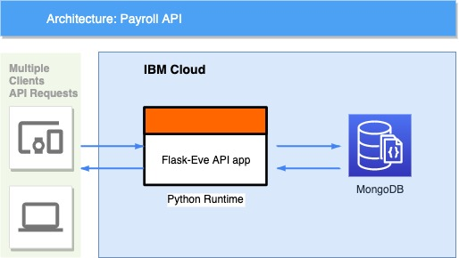

Table of Contents

- [1. Payroll API Overview](#1-payroll-api-overview)
- [2. Solution](#2-solution)
  - [2.1. Task 1](#21-task-1)
  - [2.2. Task 2](#22-task-2)
- [3. Code and Architecture](#3-code-and-architecture)
  - [3.1. Installation](#31-installation)
    - [3.1.1. Requirements](#311-requirements)
    - [3.1.2. How to run locally](#312-how-to-run-locally)
    - [3.1.3. How to run in the cloud (IBM Cloud)](#313-how-to-run-in-the-cloud-ibm-cloud)
  - [3.2. Code Structure](#32-code-structure)
    - [3.2.1. How to extend the API / create a new endpoint](#321-how-to-extend-the-api--create-a-new-endpoint)
  - [3.3. Testing](#33-testing)
  - [3.4. Architecture Diagram](#34-architecture-diagram)

================================

# 1. Payroll API Overview

This application serves as an API backend for the Payroll system. It is written Python using [Flask](http://flask.pocoo.org/), one of the most common frameworks to build APIs in Python.

The API is deployed in the cloud and can be tested on this URL: https://pers-payr.eu-de.cf.appdomain.cloud/

- As an example you can try to get all the payslips with the following: https://pers-payr.eu-de.cf.appdomain.cloud/api/v1/payslips

The documentation on all the supported endpoints can be found online here: https://documenter.getpostman.com/view/1396072/SWLb8UxQ. To test on Postman Desktop you can import the following files in the folder: [docs/postman](./docs/postman).

================================

# 2. Solution

## 2.1. Task 1

To get all the paymente slips call the following endpoint:

`curl --location --request GET 'https://pers-payr.eu-de.cf.appdomain.cloud/api/v1/payslips/'`

To get all the paymente slips from a specific year and month, call the following endpoint with the parameters 'year' and 'month':

`curl --location --request GET 'https://pers-payr.eu-de.cf.appdomain.cloud/api/v1/payslips?year=2018&month=12'`

Currently in the database you can find payslips only from 2018-12 and 2018-11.

## 2.2. Task 2

Here we developed 3 different solutions endpoints, which follow best practices of a RESTful API design:

- Solution 1: As the requirement was to create a PUT endpoint to update the payslips, you can call the following:

  1. As the PUT method requires an ID of the document to be replaced, first get the document to update like this:

     ```
     curl --location --request GET 'https://pers-payr.eu-de.cf.appdomain.cloud/api/v1/payslips/<external_id>'
     ```

     Where `<external_id>` is the 'id' from the file 'payslips.201812.txt', example:

     ```
     curl --location --request GET 'https://pers-payr.eu-de.cf.appdomain.cloud/api/v1/payslips/000000001478'
     ```


    2. Send a PUT request on this document using the '_id' and '_etag' (used for concurrency safe updates) found in the previous request the document and the new 'tax_rate' in the body payload, to update like this:

        ```
        curl --location --request PUT 'https://pers-payr.eu-de.cf.appdomain.cloud/api/v1/payslips/<_id>'
        --header 'Content-Type: application/json'
        --header 'If-Match: <_etag>'
        --data-raw '{
            "tax_rate": 10.0
        }'
        ```

        For example:

        ```
        curl --location --request PUT 'https://pers-payr.eu-de.cf.appdomain.cloud/api/v1/payslips/5e077d67982bbbe793b8f5a3'
        --header 'Content-Type: application/json'
        --header 'If-Match: 63d703b92f1b0f01c817e03333c7648eeed38d5b'
        --data-raw '{
            "tax_rate": 10.0
        }'
        ```

- Solution 2: Following the best practices for RESTful API development it is recommended to use the verb PATCH, instead of PUT, for the operation of updating the tax rate of a document. This is because the goal is to update (PATCH) the payslip doc (and recalculate its values) and not to replace it (PUT). To perform this operation follow the same steps as 'Solution 1: PUT', but use the PATCH verb to update the doc. Example:

  ```
  curl --location --request PATCH 'https://pers-payr.eu-de.cf.appdomain.cloud/api/v1/payslips/5e077d67982bbbe793b8f5a3'

  --header 'Content-Type: application/json'
  --header 'If-Match: 63d703b92f1b0f01c817e03333c7648eeed38d5b'
  --data-raw '{
      "tax_rate": 10.0
  }'
  ```

- Solution 3: We created a helper endpoint to update all the payslips in the database which are in the date range of a year and a month (as specified in the requirements). To perform this operation call the following endpoint with the values of the new 'tax_rate', the specific 'year' and 'month':

  ```
  curl --location --request POST 'https://pers-payr.eu-de.cf.appdomain.cloud/api/v1/payslips/update_all'
  --header 'Content-Type: application/json'
  --data-raw '{
      "tax_rate": 10.0,
      "year": 2018,
      "month": 12
  }'
  ```

  This sample operation will modify all the payslips in between 2018-12-01 and 2018-12-31.

================================

# 3. Code and Architecture

## 3.1. Installation

This project uses the following tools/frameworks:

- Python
- [Eve](https://docs.python-eve.org/) based on [Flask](http://flask.pocoo.org/) as backend RESTful API framework.
- [MongoDB](https://www.mongodb.com) as a database
- [IBM Cloud](https://cloud.ibm.com) as cloud provider

### 3.1.1. Requirements

- Python 3.6+
- MongoDB

### 3.1.2. How to run locally

1. Run MongoDB service locally

   - Use default Mongo setting "mongodb://localhost:27017", or change the default MongoURI and Database name on `.env` file if needed.

2. From project root folder, install requirements:

   `pip install -r requirements.txt`

3. Run app:

   `python main.py`

   You can now call the app API on `http://localhost:8080`.

   As an example to get the payslips:

   `http://localhost:8080/api/v1/payslips`

### 3.1.3. How to run in the cloud (IBM Cloud)

1. Login into IBM Cloud via its CLI:

`ibmcloud login`

2. Upload and deploy the app with the command:
   `ibmcloud cf push`

The file `manifest.yml` contains the detail for the IBM Cloud App. For more details: https://cloud.ibm.com/docs/cloud-foundry-public?topic=cloud-foundry-public-deployingapps

## 3.2. Code Structure

- main.py: to run the API Flask app.

- scripts/init_database.py:

  - This script was used to initialize the database with the file 'payslips.201812.txt'. To reset the database to the original payslips from the file run the command:

    `python script/init_database.py`.

    Change the value 'APP_HOST' to reset the app in the cloud or locally.

- api/domain.py: file that contains all the modules/endpoints.

- api/modules/payslips: folder that contains the model (type-checking and non exhaustive value validations) and the controllers for the endpoint ".../api/v1/payslips".

- .env: set the environment variables to run the Flask app.

- settings-eve.py: is the file which contains the settings needed for Eve framework.

- app/config: set the configuration setting in this folder, for example the connection details to the database.

- tests/: all the files to run unit test.

### 3.2.1. How to extend the API / create a new endpoint

Follow the same guidelines from the Eve framework, by adding a new folder under the 'api/module' with its model and controllers (similar to the module 'payslips'), and add the new module to the file 'api/domain.py'.

## 3.3. Testing

As a very short sample of testing, you can find 2 unit tests in the folder `tests`, which can be run using the command `pytest`.

## 3.4. Architecture Diagram


